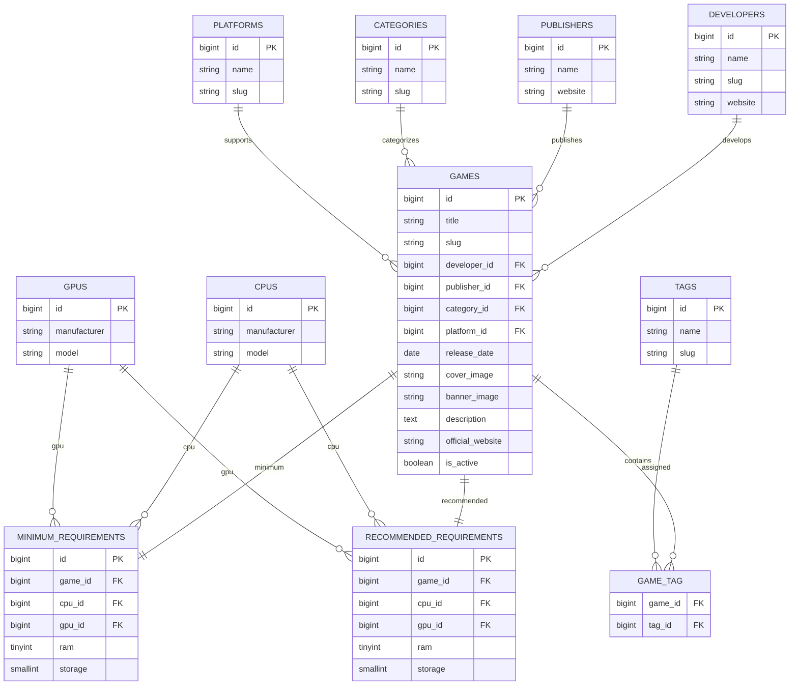

# 04 - Entity Relationship Diagram (ERD)

# Entity Relationship Diagram (ERD)

## Overview

The Entity Relationship Diagram (ERD) illustrates the logical structure of the GamingStore database and the relationships between its entities.

The database has been designed using relational database principles to ensure data integrity, reduce redundancy, and simplify future expansion.

---

# Entity Relationship Diagram



---

# Relationship Summary

The following relationships exist within the database.

| Parent Entity | Child Entity            | Relationship |
| ------------- | ----------------------- | ------------ |
| Developer     | Games                   | One-to-Many  |
| Publisher     | Games                   | One-to-Many  |
| Category      | Games                   | One-to-Many  |
| Platform      | Games                   | One-to-Many  |
| Game          | Minimum Requirement     | One-to-One   |
| Game          | Recommended Requirement | One-to-One   |
| CPU           | Minimum Requirement     | One-to-Many  |
| GPU           | Minimum Requirement     | One-to-Many  |
| CPU           | Recommended Requirement | One-to-Many  |
| GPU           | Recommended Requirement | One-to-Many  |
| Game          | Tags                    | Many-to-Many |

---

# Relationship Details

## Developer → Games

A developer can create many games.

Each game belongs to exactly one developer.

Laravel relationship:

```php
Developer::hasMany(Game::class)

Game::belongsTo(Developer::class)
```

---

## Publisher → Games

A publisher may publish multiple games.

Each game has one publisher.

---

## Category → Games

Categories organize games into genres.

Examples:

* RPG
* Action
* Adventure
* Horror

One category can contain many games.

---

## Platform → Games

Each game is currently linked to a single platform.

Examples include:

* Windows
* Linux
* macOS

This relationship can later evolve into a many-to-many relationship if games need to support multiple operating systems.

---

## Game → Minimum Requirement

Each game has one minimum hardware requirement.

This contains:

* CPU
* GPU
* RAM
* Storage
* DirectX
* Operating System

---

## Game → Recommended Requirement

Each game has one recommended hardware requirement.

These specifications represent the recommended configuration for the best gameplay experience.

---

## CPU / GPU Relationships

Hardware specifications are stored separately to eliminate duplication.

Instead of storing hardware names repeatedly, requirements reference existing CPU and GPU records using foreign keys.

Benefits include:

* Better normalization
* Easier updates
* Reduced storage
* Consistent naming

---

## Tags Relationship

Games can have multiple tags.

Examples:

* Multiplayer
* Open World
* Story Rich
* Horror

Likewise, a tag can be assigned to many games.

This many-to-many relationship is implemented using the `game_tag` pivot table.

---

# Database Normalization

The schema follows Third Normal Form (3NF).

This ensures:

* No duplicated developer information
* No duplicated publisher information
* No duplicated CPU and GPU specifications
* Flexible tagging system
* Efficient querying
* Easier maintenance

---

# Design Decisions

Several design choices were made to improve flexibility and maintainability.

### Separate Hardware Tables

CPU and GPU information is stored independently to avoid repeating specifications across games.

### Pivot Table for Tags

The `game_tag` table supports unlimited tags per game while allowing each tag to be reused.

### One-to-One Requirement Tables

Minimum and recommended requirements are separated to clearly distinguish baseline and optimal hardware specifications.

### Soft Deletes

Games use soft deletes so records can be restored if deleted accidentally.

---

# Future Expansion

The current schema is designed to support future modules without major structural changes.

Potential additions include:

* Reviews
* Ratings
* Wishlists
* Favorites
* User Systems
* Compatibility Results
* Achievements
* Screenshots
* DLC
* News
* Notifications

These modules can be integrated by adding new tables and relationships while preserving the existing database structure.

---

# Conclusion

The GamingStore ERD demonstrates a normalized and modular relational database. Clear entity boundaries, well-defined relationships, and the use of foreign keys provide a scalable foundation for future development while maintaining data integrity and reducing redundancy.
